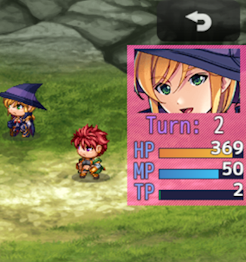

# 戦闘ステータス追加プラグイン（NLM_AnotherBattleStatusMZ.js）
### RPGツクールMZ専用プラグイン

戦闘アクターコマンド入力時に顔付きステータスウインドウをもう一つ追加表示します

ステータスは選択中の一人分のみの表示で、タイムゲージは表示されません  
名前の部分は、パラメータ設定で任意の文字列（制御文字可）に置き換えが可能です  
簡易的な一行情報ウインドウとしても利用できるかも知れません

# download

プラグイン単独での download は、[右クリック「名前を付けてリンク先を保存」](https://github.com/nolimits-tukool/NLM_AnotherBattleStatusMZ/raw/refs/heads/main/NLM_AnotherBattleStatusMZ.js)  
RPGツクールMZ専用です

プラグイン入りの**サンプルプロジェクト**（カードゲームMZサンプル3）は [ここから **download**](https://github.com/nolimits-tukool/CardGameMZSample3/raw/refs/heads/main/CardMZSample3.zip)

# license

　MITライセンスの通りです

## [プロフィールへ](https://github.com/nolimits-tukool)

